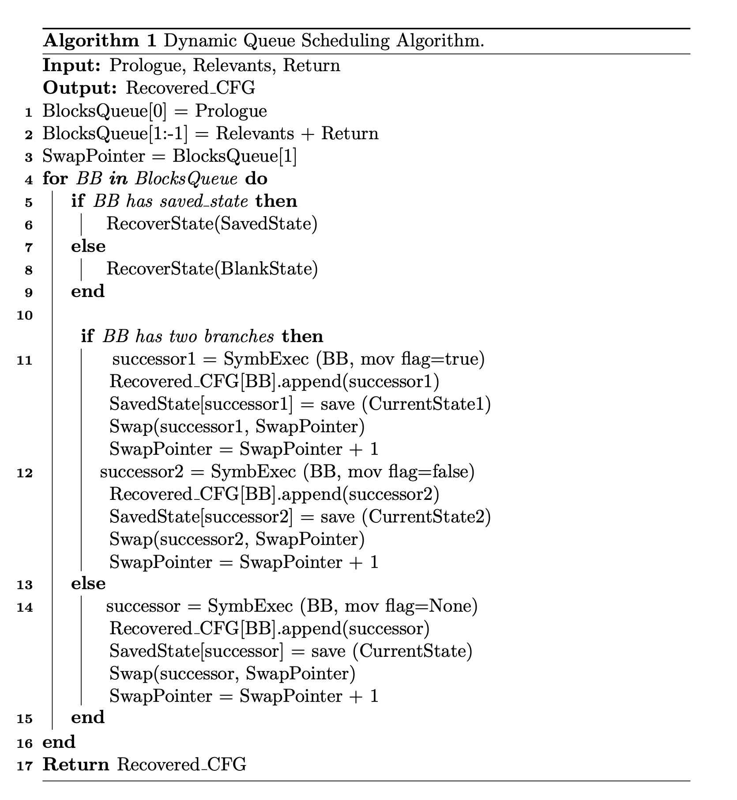

# Comparison with State-of-the-art Approaches

## Tables show the deobfuscation results of DiANa. Red part is the results of State-of-the-art Approaches. 
(R2) Notice that samples in Table.2 and 3 are all in-the-wild O-LLVM obfuscated apps, and DiANa works on function level.

## (R1/R2) Also, we use a high-level algorithm to re-describe the workflow.

